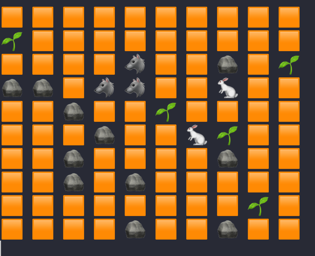

# Simulation

The essence of the project is a step-by-step simulation of a 2D world inhabited by herbivores and predators. In addition
to existence, the world contains resources (grass) that herbivores feed on and static objects that can be interacted
with - they just take up space.

The goal of the project is to develop object-oriented programming skills, as well as algorithms and data structures. For
example, path search is implemented using the breadth-first search
algorithm.

#### Install Required

* php >= 8.0
* XAMPP (for OS Windows)

#### Get Started

* Linux

> $ git clone https://github.com/illyalee/simulation.git

> $ cd path/to/simulation

> $ make simulation or php bin/simulation

> Set how many simulation iterations you want to see

> view simulation in terminal

* Windows

> Download XAMPP

> Set up XAMPP in C: disk as default (it's important)

> $ git clone https://github.com/illyalee/simulation.git

> $ cd path/to/simulation

> $ C:\xampp\php\php.exe bin/simulation

> Set how many simulation iterations you want to see

> view simulation in terminal
